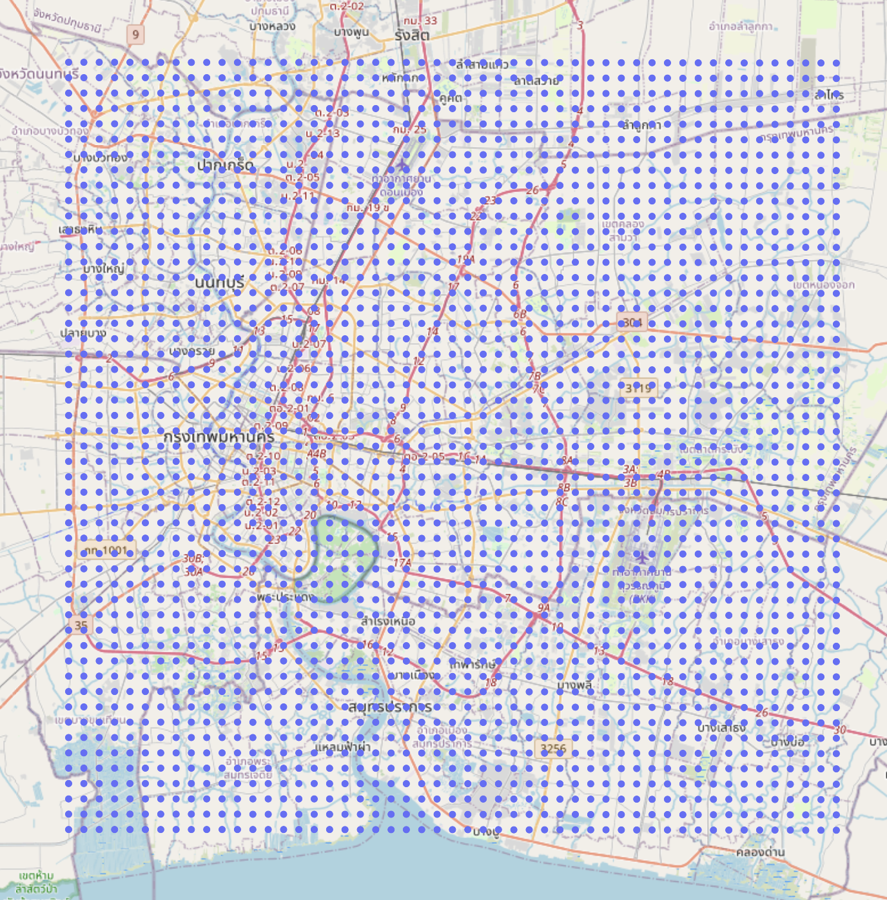

# [WIP] Google Map Places Scraper

## TODO
- [x]  genernate lat / long points
- [x] places scraper
- [ ] place's detail scraper

## Generate points
```sh
go run cmd/genpoints/main.go 13.971514 100.403076
```

## Visualize points
```sh
pip3 install plotly
python3 plot.py
```


## Scrape places
```sh
go run cmd/pscraper/main.go restaurants
```

## Scrape places
#TODO
